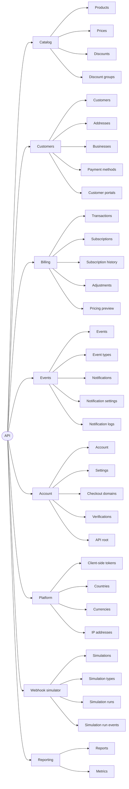

## Design Pattern

Here is an example:
```
payment = new PaymentProvider("stripe", config) 
payment.product.create(...)
```


#### Paddle Diagram


```mermaid
flowchart LR
  API([API])

  API --> catalog[Catalog]
  API --> customers[Customers]
  API --> billing[Billing]
  API --> events[Events]
  API --> account[Account]
  API --> platform[Platform]
  API --> webhook[Webhook simulator]
  API --> reporting[Reporting]

  catalog --> c1[Products]
  catalog --> c2[Prices]
  catalog --> c3[Discounts]
  catalog --> c4[Discount groups]

  customers --> u1[Customers]
  customers --> u2[Addresses]
  customers --> u3[Businesses]
  customers --> u4[Payment methods]
  customers --> u5[Customer portals]

  billing --> b1[Transactions]
  billing --> b2[Subscriptions]
  billing --> b3[Subscription history]
  billing --> b4[Adjustments]
  billing --> b5[Pricing preview]

  events --> e1[Events]
  events --> e2[Event types]
  events --> e3[Notifications]
  events --> e4[Notification settings]
  events --> e5[Notification logs]

  account --> a1[Account]
  account --> a2[Settings]
  account --> a3[Checkout domains]
  account --> a4[Verifications]
  account --> a5[API root]

  platform --> p1[Client-side tokens]
  platform --> p2[Countries]
  platform --> p3[Currencies]
  platform --> p4[IP addresses]

  webhook --> w1[Simulations]
  webhook --> w2[Simulation types]
  webhook --> w3[Simulation runs]
  webhook --> w4[Simulation run events]

  reporting --> r1[Reports]
  reporting --> r2[Metrics]
```

#### Stripe Diagram

#### PayPal Diagram


